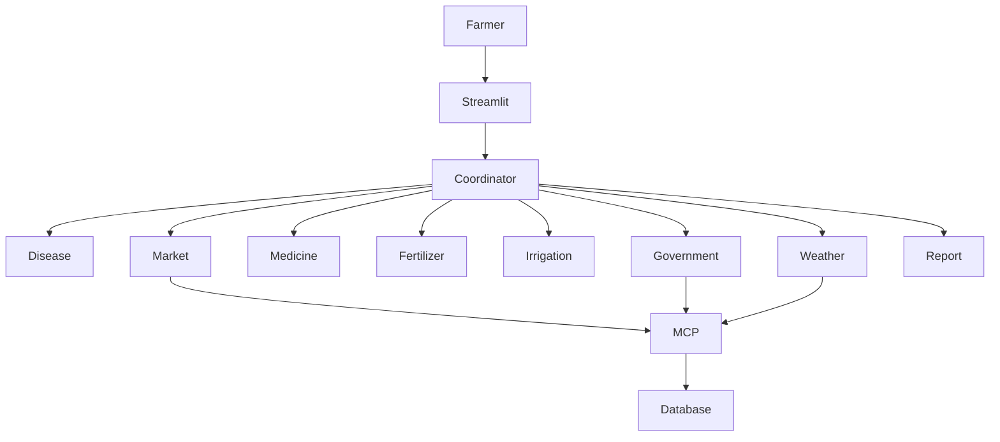

# 🌾 CropCare AI

> ### Intelligent Offline Multi-Agent Farming Assistant

Empowering farmers with AI-powered crop diagnosis, weather analysis, fertilizer planning, irrigation guidance, market intelligence, and government scheme recommendations — **completely offline**.


---

# ✨ Features

- 🌱 Crop Disease Detection
- 🌦 Weather Risk Analysis
- 💊 Medicine Recommendation
- 🌾 Fertilizer Planning
- 💧 Irrigation Scheduling
- 📈 Market Price Analysis
- 🏛 Government Scheme Finder
- 📄 Farm Action Plan Generator

---

# 🏗️ System Architecture



---

# 📦 Project Structure

```text
CropCare-AI/
│
├── agents/
├── data/
├── mcp/
├── skills/
├── tools/
├── app.py
├── requirements.txt
└── README.md
```

---

# ⚙️ Installation

### 1️⃣ Clone Repository

```bash
git clone https://github.com/yourusername/CropCare-AI.git

cd CropCare-AI
```

### 2️⃣ Create Virtual Environment

```bash
python -m venv venv
```

### 3️⃣ Activate Environment

Windows

```bash
venv\Scripts\activate
```

Linux / macOS

```bash
source venv/bin/activate
```

### 4️⃣ Install Dependencies

```bash
pip install -r requirements.txt
```

---

# ▶️ Run Project

Start the Streamlit application.

```bash
streamlit run app.py
```

Open your browser and visit:

```text
http://localhost:8501
```

---

# 🧪 Test Project

Run the complete multi-agent pipeline.

```bash
python test_agents.py
```

---

# 🎬 End-to-End Demo Flow

### 1️⃣ Select Crop

Choose the crop from the dashboard.

---

### 2️⃣ Select State & District

Used for weather, market prices, and government schemes.

---

### 3️⃣ Upload Leaf Image

Upload a JPG or PNG image.

---

### 4️⃣ Enter Symptoms

Example:

```text
Yellow spots on leaves with white powder.
```

---

### 5️⃣ Click "Analyze Crop Health"

The Coordinator Agent invokes all specialist agents.

---

### 6️⃣ Download Farm Action Plan

The complete report is generated and saved locally.

---

# 🤖 Multi-Agent Workflow

✅ Disease Detection Agent

✅ Weather Advisor Agent

✅ Medicine Recommendation Agent

✅ Fertilizer Advisor Agent

✅ Irrigation Planner Agent

✅ Market Analysis Agent

✅ Government Scheme Agent

---

# 🏆 Kaggle AI Agent Concepts

| Concept | Status |
|---------|--------|
| Multi-Agent System | ✅ |
| MCP Server | ✅ |
| Agent Skills | ✅ |
| Security | ✅ |
| Offline Deployment | ✅ |

---

# 🛠 Tech Stack

- Python
- Streamlit
- Pillow
- Pandas
- JSON
- JSON-RPC MCP
- Markdown Skills

---

# 🔒 Security

- ✅ No API Keys
- ✅ Offline Execution
- ✅ Path Traversal Protection
- ✅ Input Validation
- ✅ Secure File Writing

---

# 📜 License

MIT License.

---

# ⭐ Support

If you found this project useful, please consider giving it a **⭐ Star** on GitHub.
